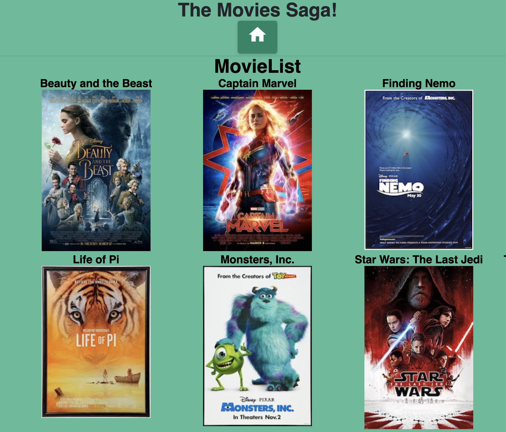
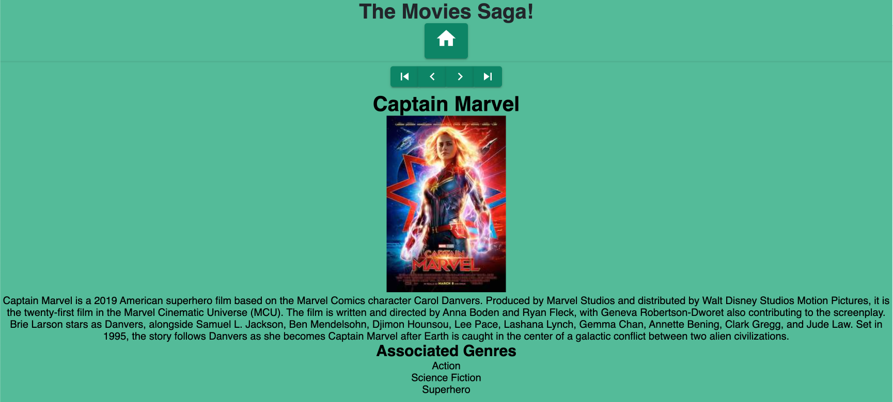

# Movies Saga (W12)
## Description
Duration 05/11/23-05/13/23 weekend project.

I was taked with creating an application to view movie that are stored within a database. Each movie has it's own detailed view, that pulls in a description of the movie and lists the associated genres.

## Screen Shots
### Home Page

### Details Page

## Prerequisites

- [Node.js](https://nodejs.org/en/)
    - This is for hosting the server and communicating with the database.
- [PostgreSQL](https://www.postgresql.org/)
    - This is used for hosting the database.
- [Postico](https://eggerapps.at/postico/v1.php)
    - This is used to set up your initial test database.

## Installation

1. Node Module
    1. Once Node is installed with the link located in the Prerequisites, you will need to perform the following command within your terminal `npm install`
        -  This will install the node_modules folder which includes the dependencies for the app.

2. Set up your database
    1. Using Postico, create a database titled `saga_movies_weekend`.
    2. Use the database.sql file to enter your initial starting data into your database.

3. You will need two terminals to operate the app properly.
    1. The first you will run the command `npm run server`
        - This will host the server on [localhost:5000](http://localhost:5000/)
    2. The second you will run the command `npm run client`
        - This should open up your browser on [localhost:3000](http://localhost:3000/)

## Usage
Once the page is open, you should see a number of movie posters and their movie names above them.

- To view details on a given movie, just click on that image.
    - You will be taken to a new page that includes the details on your movie.

- From within the details page you are able to go back to the main page by clicking on the `Home` icon within the header.
- You are also able to directly navigate to:
    - The first movie in the list
        - To do so, click on the farthest button to the left `|<`
    - The previous movie within the list
        - To do so, click on the arrow button pointing to the left `<`
    - The next movie within the list
        - To do so, click on the arrow button pointing to the right `>` button
    - The last movie in the list
        - To do so, click on the farthest button to the right `>|`
### Details Page - navigation bar

## Built With

- JavaScript
  - Node.js
  - Express.js
  - React.js
    - React Router
  - Redux.js
    - Redux-Sagas
- Material-ui
- PostgreSQL
- Postico

## Acknowledgement

  - Thanks to [Prime Digital Academy](www.primeacademy.io) who equipped and helped me to make this application a reality.

## Support
If you have suggestions or issues, please email me [here](mailto:joshua.engebretson@gmail.com).
